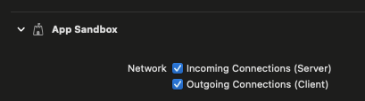

# OSCKit Socket Example

This example demonstrates OSC communication using the `OSCSocket` class.

The `OSCSocket` class internally combines both an OSC server and client sharing the same local UDP port number. What sets it apart from `OSCServer` and `OSCClient` is that it does not require enabling port reuse to accomplish this. It also can conceptually make communicating bidirectionally with a single remote host more intuitive.

This also fulfils a niche requirement for communicating with OSC devices such as the Behringer X32 & M32 which respond back using the UDP port that they receive OSC messages from. For example: if an OSC message was sent from port 8000 to the X32's port 10023, the X32 will respond by sending OSC messages back to you on port 8000.

## Entitlements

If you are adding OSCKit to a macOS project that has the Sandbox entitlement, ensure that the network options are enabled. These entitlement options are already set in the example project.

## Build Note

If Xcode builds but the app does not run, it may be because Xcode is defaulting to the wrong Scheme. Ensure the example app's Scheme is selected then try again.
