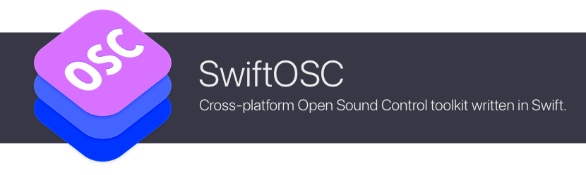

# SwiftOSC

[](https://swiftpackageindex.com/orchetect/swift-osc) [](https://swiftpackageindex.com/orchetect/swift-osc) [](https://github.com/orchetect/swift-osc/blob/main/LICENSE)

Open Sound Control ([OSC](https://opensoundcontrol.stanford.edu)) toolkit written in Swift for Apple platforms, Linux, and Android.

- OSC address pattern matching and dispatch
- Convenient OSC message value type masking, validation and strong-typing
- Modular: use the provided network I/O layer by default, or use your own
- Support for custom OSC types
- Supports Swift 6 strict concurrency
- Fully unit tested
- Full DocC documentation

## Core Repository

All network I/O extension repositories depend on **SwiftOSC Core**. It provides value types, encoding/decoding logic and message dispatch abstractions.

| Repository                                                   | Description                        | Apple | Linux | Android | Windows |
| :----------------------------------------------------------- | :--------------------------------- | :---: | :---: | :-----: | :-----: |
| [swift-osc-core](https://github.com/orchetect/swift-osc-core) | Types, encoding/decoding, dispatch |   🟢   |   🟢   |    🟢    |    -    |

## Network I/O Extension Repositories

A limited number of network I/O backends are available, with more added in future on a needs-be basis.

| Repository                                                   | Description                  | Apple | Linux | Android | Windows |
| :----------------------------------------------------------- | :--------------------------- | :---: | :---: | :-----: | :-----: |
| [swift-osc-io-cocoa](https://github.com/orchetect/swift-osc-io-cocoa) | CocoaAsyncSocket I/O backend |   🟢   |   -   |    -    |    -    |
| [swift-osc-io-nio](https://github.com/orchetect/swift-osc-io-nio) | SwiftNIO I/O backend         |   🟢   |   🟢   |    🟢    |    -    |

## Getting Started

The library and its extensions are available as Swift Package Manager (SPM) packages.

### Entire Library (With Default Cross-platform Network I/O)

To get started with all extensions:

1. Add the **swift-osc** umbrella repo as a dependency.

   ```swift
   .package(url: "https://github.com/orchetect/swift-osc", from: "3.0.0")
   ```

2. Add **SwiftOSC** to your target.

   ```swift
   .product(name: "SwiftOSC", package: "swift-osc")
   ```

3. Import **SwiftOSC** to use it. This will import the core module and default network I/O module.

   ```swift
   import SwiftOSC
   ```

4. See the [getting started guide](https://swiftpackageindex.com/orchetect/swift-osc/main/documentation) and the [code examples](https://github.com/orchetect/swift-osc-io-cocoa/tree/main/Examples) for the default network I/O module to see the library in action.

### Individual Extensions

To use a specific network I/O module, use the respective I/O repository as a dependency instead of the **swift-osc** umbrella repository.

## Documentation

Full online documentation is available for all of the extension repositories. Check the README in each repository for a link to its documentation.

For new users, see the [getting started guide](https://swiftpackageindex.com/orchetect/swift-osc/main/documentation) and the [code examples](https://github.com/orchetect/swift-osc-io-cocoa/tree/main/Examples) for the default network I/O module to see the library in action.

## Author

Coded by a bunch of 🐹 hamsters in a trenchcoat that calls itself [@orchetect](https://github.com/orchetect).

## License

Licensed under the MIT license. See [LICENSE](LICENSE) for details.

## Sponsoring

If you enjoy using SwiftOSC and want to contribute to open-source financially, GitHub sponsorship is much appreciated. Feedback and code contributions are also welcome.

## Community & Support

Please do not email maintainers for technical support. Several options are available for issues and questions:

- Questions and feature ideas can be posted to [Discussions](https://github.com/orchetect/swift-osc/discussions).
- If an issue is a verifiable bug with reproducible steps it may be posted in [Issues](https://github.com/orchetect/swift-osc/issues).

## Contributions

Contributions are welcome. Posting in [Discussions](https://github.com/orchetect/swift-osc/discussions) first prior to new submitting PRs for features or modifications is encouraged.

## Code Quality & AI Contribution Policy

In an effort to maintain a consistent level of code quality and safety, this repository was built by hand and is maintained without the use of AI code generation.

AI-assisted contributions are welcome, but must remain modest in scope, maintain the same degree of quality and care, and be thoroughly vetted before acceptance.

## Legacy

This repository was previously a mono-repo known as **OSCKit**. In April of 2026 it was renamed **swift-osc** and I/O modules were split off into their own extension repositories.
